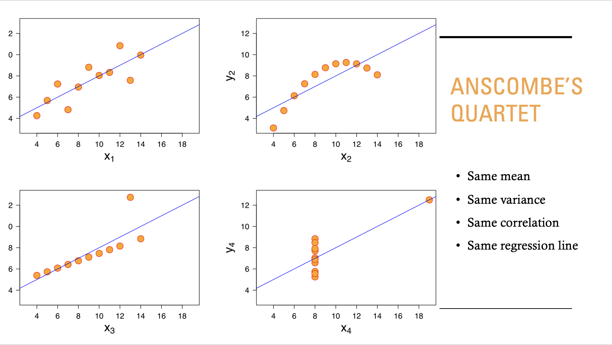

# Correlation, Causation & Confusion Why Most ‘Insights’ Are Illusions
Guest Lecture | University of Lagos | April 2026

This repository contains materials from a guest lecture I delivered for the Department of Statistics at the University of Lagos.

## Overview 

This project explores common pitfalls in data analysis and how misleading insights can arise when correlation is mistaken for causation.

Through a series of examples and case studies, this project demonstrates how strong statistical relationships can appear convincing but fail to represent real-world truth.

The goal is to highlight the importance of critical thinking, data validation, and understanding how data is generated when drawing conclusions.

## Key Concepts Explored

### Anscombe’s Quartet

Even when datasets share identical statistical summaries—such as the same mean, variance, correlation, and regression line, they can have completely different underlying structures.

As shown in this example, relying only on summary statistics can hide important patterns in the data.

### Spurious Correlations
When variables appear related but have no causal connection

### Simpson's Paradox:
When a trend within groups reverses or disappears when the data is combined

### Causal Myths in Big Data:
Common misconceptions such as “more data means more truth” and the belief that machine learning automatically uncovers causation

### Observational Data traps:
How the way data is collected can lead to misleading conclusions (e.g., selection bias, measurement bias, reverse causality)

### How Statisticians Avoid these Traps:
Approaches like careful study design, controlling for confounders, and applying skepticism to produce more reliable insights

## Key insight

Not all statistically significant patterns reflect real-world relationships.
Careful reasoning and skepticism are essential when interpreting data.

## Author 
Tayla Stanley-Timla
Statistics Graduate | Data Analyst
