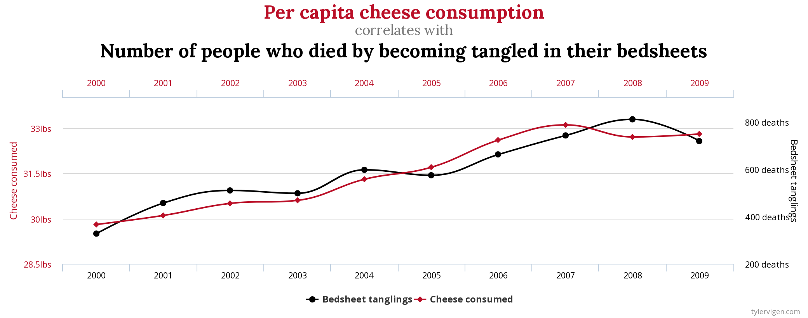
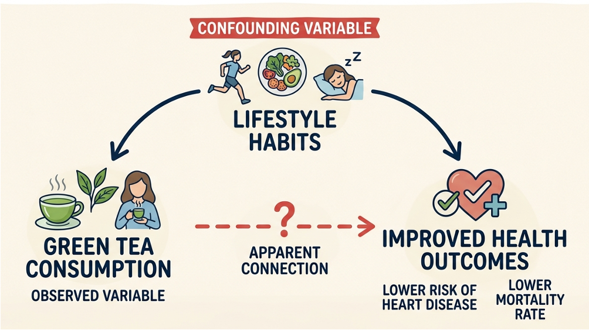
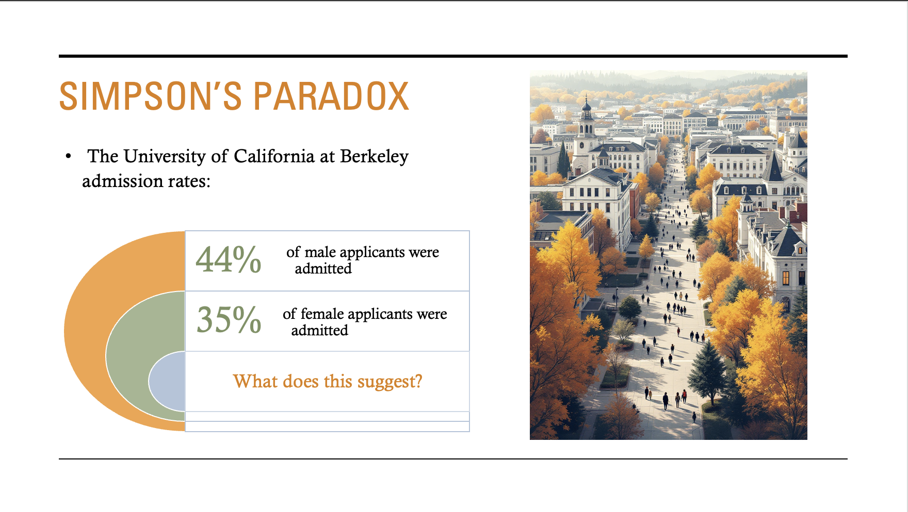
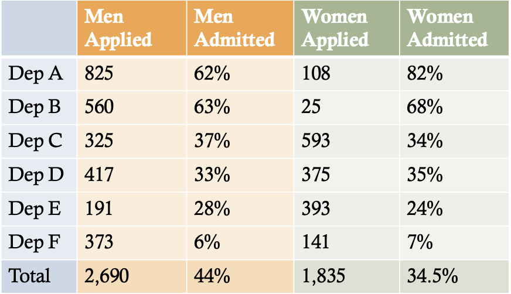
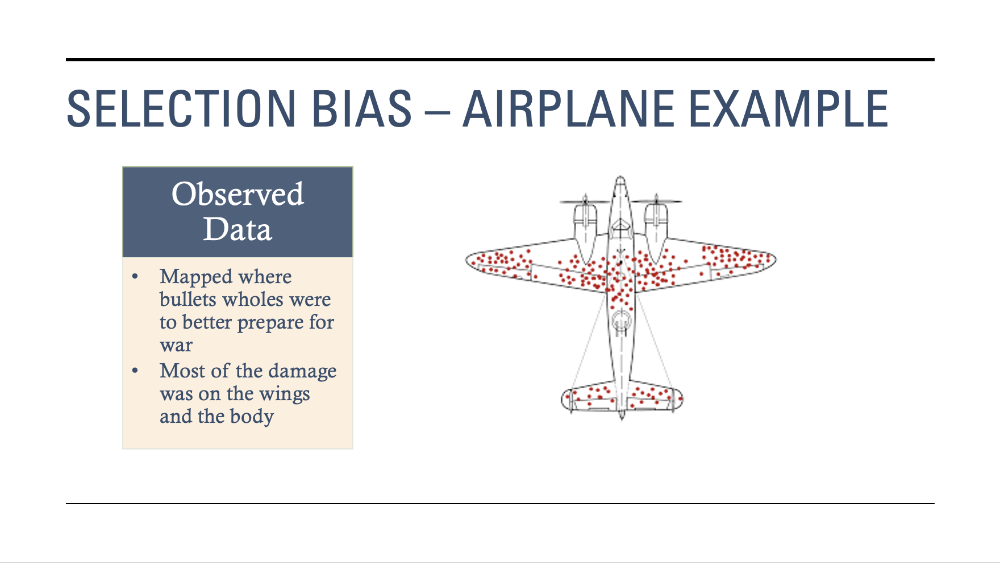
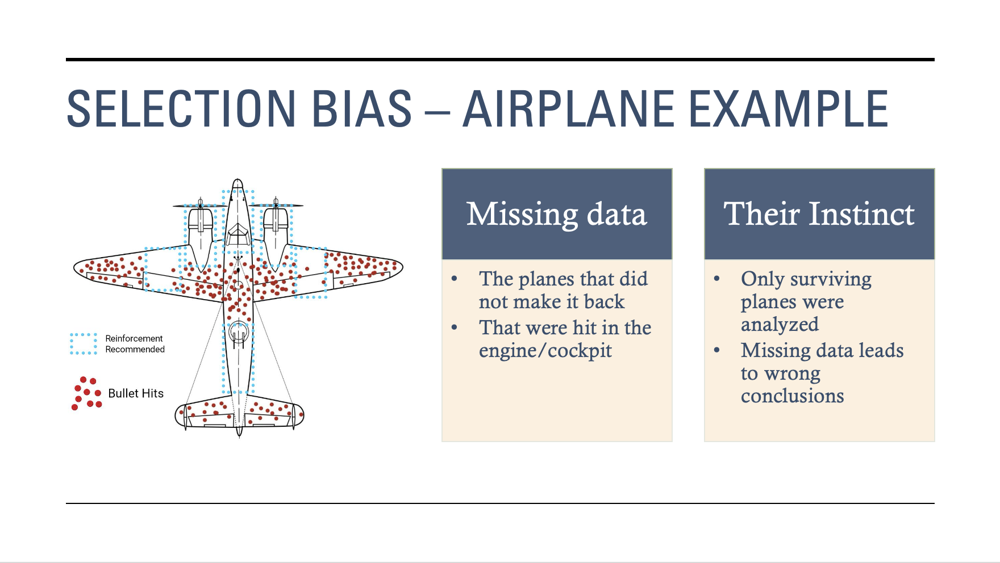

# Correlation, Causation & Confusion Why Most ‘Insights’ Are Illusions
Guest Lecture | University of Lagos | April 2026

This repository contains materials from a guest lecture I delivered for the Department of Statistics at the University of Lagos.

## Overview 

This project explores common pitfalls in data analysis and how misleading insights can arise when correlation is mistaken for causation.

Through a series of examples and case studies, this project demonstrates how strong statistical relationships can appear convincing but fail to represent real-world truth.

The goal is to highlight the importance of critical thinking, data validation, and understanding how data is generated when drawing conclusions.

## Anscombe’s Quartet

All four of the datasets below have the same mean, variance, correlation, and regression line. 

Even when datasets share identical statistical summaries, they can have completely different underlying structures.

As shown in this example, relying only on summary statistics can hide important patterns in the data.

## Spurious Correlations

A spurious correlation occurs when two variables appear related but have no real causal connection.

- Cheese consumption vs deaths from bedsheets
- Strong correlation (~94%) but no logical relationship

This example came from a process called data dredging. Thousands of variables were compared. Some relationships will appear statistically significant purely by chance.

Spurious Correlations arise from:

- Random coincidence
- Confounding Variable

Statistical significance does not guarantee a meaningful relationship.

#### Correlation With Confounders

Observational studies found that green tea drinkers had better health outcomes.

However, this does not mean green tea causes better health.

The study found that green tea drinkers also had higher socioeconomic statuses, ate healthier diets, had more access to healthcare, exercised more, and were more health-conscious.

Lifestyle factors are confounders that influence both:

- Green tea consumption
- Health outcomes

The correlation between green tea consumption and health outcomes may reflect underlying differences between groups. From this observational study, we are not able to deduce that drinking green tea lowers the risk of heart disease and increases lifespan.

## Simpson's Paradox

Men had higher admission rates than women in graduate study programs at the University of California at Berkley. 

But when broken down by department the bias disappears.

Why?

- Women applied more to competitive programs
- Men applied more to less competitive programs

This creates a misleading overall trend. Aggregated data can hide important subgroup patterns.

## Causal Myths in Big Data

Common misconceptions such as “more data means more truth” 

More data increases the chance of finding false patterns. More data does not fix bias, confounding or flawed assumptions or that the model might be making. If your data is biased, more data just makes you more confidently wrong.

Big data can amplify mistakes.

## Observational Data traps

How the way data is collected can lead to misleading conclusions through:

- Confounding Variable
- Selection Bias
- Measurement Bias
- Research Bias 
- Reverse Causality
- Practical Data challenges

### Selection Bias Example 

During World War II, engineers analyzed returning aircraft to determine where to reinforce them. They observed that most bullet holes were concentrated on the wings and body of the planes.

Their instinct was to reinforce the areas with the most damage.

However, this would have been the wrong decision.

The data only included planes that successfully returned. Aircraft that were hit in more critical areas, such as the engine or cockpit, did not make it back and were therefore missing from the dataset.

- Areas with fewer bullet holes were actually the most vulnerable
- The correct conclusion was to reinforce the areas with the least visible damage.

What’s missing from the data can be just as important as what’s present.

## How Statisticians Avoid these Traps:

Approaches like careful study design, controlling for confounders, using causal thinking, and applying skepticism to produce more reliable insights.

## Key insight

Not all statistically significant patterns reflect real-world relationships.
Careful reasoning and skepticism are essential when interpreting data.

## Author 
Tayla Stanley-Timla
Statistics Graduate | Data Analyst
